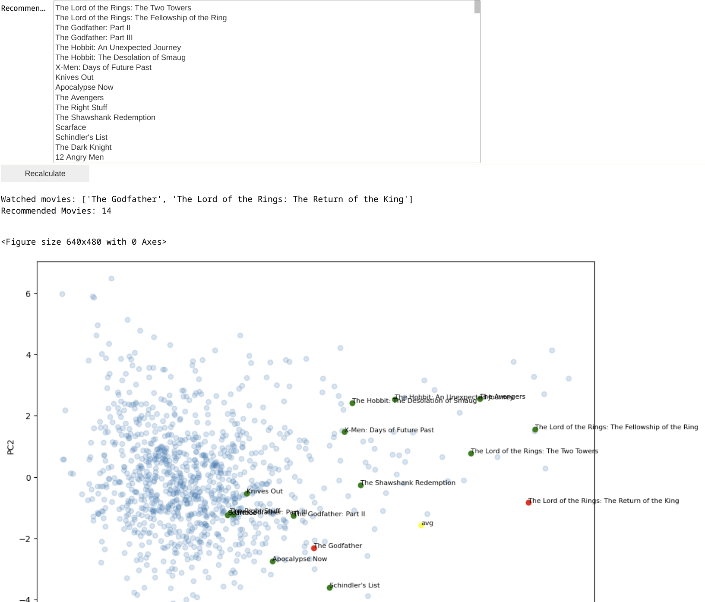
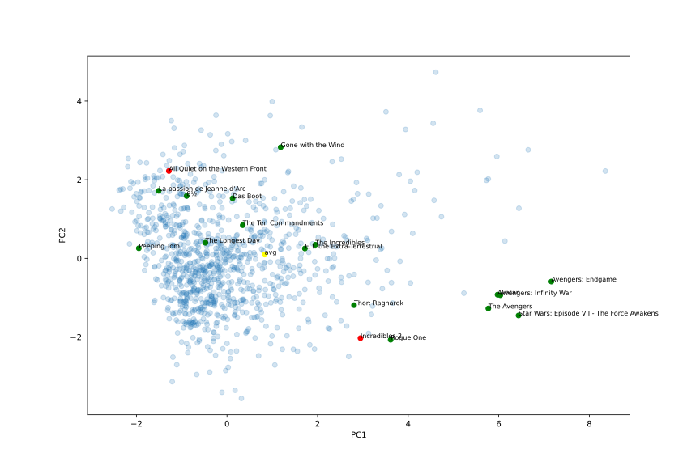

# Content-Based Recommendation of movies
The aim of the project is to create a movie recommendation system. The implemented algorithm will recommend movies based solely on the similarity between items in the dataset, not on user similarity.

## Inputs and Outputs
The algorithm will process a movie dataset from IMDB available at: https://www.kaggle.com/datasets/harshitshankhdhar/imdb-dataset-of-top-1000-movies-and-tv-shows

It will recommend movies from this dataset to the user for recommendation. The user will mark movies they have watched, and based on the watched movies, the algorithm will sort the list to have more similar movies at the beginning.

## Solution
### Data Preparation
The algorithm first converts the data into numerical form.

Several columns such as budget or release year have nominal interpretation, so they are transformed into numbers using simple operations (e.g., removing "min" from movie length) and then standardized: $value = (x - μ) / σ.$

Most columns are ordinal, such as movie title, overview, or director. For these columns, various data operations are required (lemmatization, splitting genres like Action, Comedy) as part of preprocessing. Further, one-hot encoding is performed, followed by conversion to an inverse-index matrix. After one-hot encoding, columns that have only one non-zero value can be removed since they do not add useful information to the dataset. After this transformation, the dataset contains nearly 4000 columns. Subsequently, column normalization is performed using the TF-IDF index. Since the concept of term frequency doesn't make sense for the movie dataset (each actor typically appears in a movie only once, movie titles and overviews are too short), a value of 1 is assigned to it everywhere, and only the IDF part of the score is used, which is the logarithm of the number of documents (movies) divided by the number of documents in which the term (actor, genre, etc.) appears. Very common terms like "of" will have a very small value, whereas terms that appear only exceptionally, like "Godfather", will have a high value.

### Recommendation Algorithm
Movies are initially recommended based on ratings, and then the user can select one or more movies to start the recommendation algorithm. The algorithm selects the nearest neighbors for each movie using the cosine metric and then averages the neighbors. These averages are then moved to the beginning of the list of all movies, sorted by the smallest distance to any watched movie.

### Implementation
The implementation uses the Python programming language, Jupyter notebooks environment, and high-level libraries. It utilizes pandas and numpy for data manipulation, NLTK for lemmatization, matplotlib for visualization, and sklearn for the nearest neighbor algorithm and PCA. The application consists of files for data processing, implementation of the recommendation algorithm based on processed data, and a UI file containing a simple user interface that utilizes both modules.

### Example Output
Here, the user has watched "The Godfather" and "The Lord of the Rings", and the system recommends all other parts of "The Lord of the Rings", other parts of "The Godfather", as well as other mafia-themed movies like "Scarface", "Pulp Fiction", and "Goodfellas". The output is displayed both as a new order of movies in the list and a visualization of points in the reduced dimension space using PCA. Red points represent watched movies, yellow is their average, and green points are recommended movies. It's important to note that the movies are recommended based on cosine distance and in the unreduced space, so the distances visible to humans have a different meaning. Nevertheless, the basic idea is conveyed in the output.

## Discussion
During data preparation, I experimented with various approaches.

### Naive Approach
The first approach is a classic data science approach using the Euclidean metric, which retains only the most important data due to the dimensionality problem. This data can then be further reduced using PCA. Very good results were achieved even with 100 columns. Processing data in this way means retaining only information that is common to many records and discarding detailed specific information. It could be expected that a system processing data in this way would place much greater emphasis on features that are common to all movies, such as budget, certificate, age recommendation, or release year, and would better recommend movies from well-known directors with famous actors.

Based on the watched movies "The Godfather" and "The Lord of the Rings", the system recommends the following:

- 0	The Lord of the Rings: The Return of the King	1.099009
- 1	The Lord of the Rings: The Two Towers	1.638824
- 2	The Godfather: Part II	2.458201
- 3	Pulp Fiction	2.716605
- 4	Schindler's List	3.235023
- 5	Forrest Gump	3.425054
- 6	Interstellar	3.490620
- 7	The Dark Knight Rises	3.597778
- 8	Saving Private Ryan	3.642032
- 9	Inception	3.658369
- 10 Goodfellas	3.849089
- 11 The Silence of the Lambs	3.926114
- 12 One Flew Over the Cuckoo's Nest	3.928820
- 13 The Shawshank Redemption	3.929794

The system correctly identified additional parts of "The Godfather" and "The Lord of the Rings". However, it did not recommend the 3rd part of "The Godfather" or "The Hobbit". The system is thus not able to identify very similar items well, but it does well in terms of genre and overall movie quality. Recommendation via this approach is not very targeted, but quite general. It works very well for recommending within genres, such as fairy tales, where seeing just one fairy tale is enough to recommend the entire genre, as there aren't significant differences.

### TF-IDF and Cosine Similarity Approach
The second approach uses cosine similarity, a sparse matrix of data, maximally extracted data. Ordinal data is encoded using one-hot transformation, values are assigned as 0 or 1 for the presence or absence of a feature. Data processed in this way has around 4000 rows and the dimensionality is not further reduced. This approach also adds TF-IDF normalization of the data. It gives greater emphasis to identical but less frequent features compared to features common to a larger number of movies.

Based on the watched movies "The Godfather" and "The Lord of the Rings", the system recommends the following:

- 0	The Lord of the Rings: The Return of the King	0.630932
- 1	The Lord of the Rings: The Two Towers	0.681674
- 2	The Godfather: Part II	0.700961
- 3	The Godfather: Part III	0.712002
- 4	Harry Potter and the Deathly Hallows: Part 2	0.816390
- 5	The Hobbit: An Unexpected Journey	0.825127

The system handles both detailed similarity and general similarity very well. It found all parts of "The Godfather" and "The Lord of the Rings," and also recommends movies with mafia themes like "Scarface," "Goodfellas," and "Pulp Fiction."

#### Discussion on Using Averages
The original recommendation approach was based on recommending movies based on the shortest distance to the nearest movie. Then, I considered changing the system to recommend based on averages. However, this has several disadvantages: many users enjoy multiple genres, e.g., horror and romantic comedy. If these types of movies were averaged, the system could recommend entirely irrelevant movies and tend to neglect detailed comparisons of the movies themselves. To test this hypothesis, I combined both approaches and observed which movies were added based on averages that wouldn't have been included in the recommendations otherwise.

In most cases, averaging didn't add new movies, as the recommended movies were already close to the watched movies, making averaging less likely to recommend something new. I selected two movies on the opposite side of the spectrum for testing purposes: "The Incredibles 2" and "All Quiet on the Western Front" (see PCA). Due to the average, the movies "E.T. the Extra-Terrestrial" and "Thor: Ragnarok" were added.

The final conclusion is that in cases where averages might work, they aren't necessary, as the movies are already chosen based on the distance to the watched movies, and if the average suggests something new, it's likely not relevant. It's more of an optimization that I left in the system for study purposes, including visualization. Nevertheless, the system would work well even without it.

## Conclusion
One interesting finding is that even this simple approach provides very good results. In practical use, however, it would be a pity to overlook user similarity, as it contains valuable information. While this solution would have a high time complexity on a larger dataset, the current solution uses a brute-force nearest neighbor algorithm with a complexity of $O(N * N * D)$, where $N$ is the number of records and $D$ is the dimensionality. If needed, the Scikit-learn library offers algorithms like BallTree with complexity $O(N * log(D))$ or KDTree approaching $O(N * D)$. In practice, this complexity cannot be linear with respect to the number of all movies, so some kind of space indexing would definitely be necessary.

## How to run

- Install requirement libraries.
- run UI.ipynb
